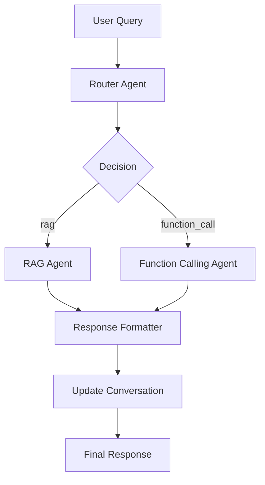

# Multi-Agent Architecture for openBIS Chatbot

## Overview

The openBIS chatbot has been enhanced with a multi-agent architecture that enables both **documentation queries** (RAG) and **function execution** (pybis tool calling). This allows users to not only ask questions about openBIS but also perform actions directly on openBIS instances.

## Architecture Components

### 1. Router Agent
- **Purpose**: Analyzes user queries and decides which agent should handle the request
- **Decision Types**:
  - `rag`: For documentation and informational queries
  - `function_call`: For action-oriented requests
  - `conversation`: For general conversation (fallback to RAG)

### 2. RAG Agent
- **Purpose**: Handles documentation-based questions using Retrieval-Augmented Generation
- **Functionality**:
  - Retrieves relevant chunks from processed openBIS documentation
  - Generates contextual responses using the LLM
  - Maintains conversation history and context

### 3. Function Calling Agent
- **Purpose**: Executes pybis functions based on user requests
- **Capabilities**:
  - Connection management (connect/disconnect from openBIS)
  - Sample management (list, get, create samples)
  - Dataset management (list, get datasets)
  - Space and project management
  - Tool selection and parameter extraction

### 4. Response Formatter
- **Purpose**: Formats the final response regardless of which agent processed the query
- **Functionality**: Ensures consistent response format across all agents

## Workflow



## Comprehensive pybis Tools (25+ Functions)

### Connection Management
- `connect_to_openbis`: Connect to an openBIS server with credentials
- `disconnect_from_openbis`: Disconnect from openBIS and clean up session
- `check_openbis_connection`: Check connection status and show details

### Space Management
- `list_spaces`: List all spaces in openBIS
- `get_space`: Get details of a specific space by code
- `create_space`: Create a new space with description

### Project Management
- `list_projects`: List projects (optionally filtered by space)
- `get_project`: Get details of a specific project by identifier
- `create_project`: Create a new project in a space

### Experiment/Collection Management
- `list_experiments`: List experiments with filtering options
- `get_experiment`: Get details of a specific experiment
- `create_experiment`: Create a new experiment in a project

### Sample/Object Management
- `list_samples`: List samples with comprehensive filtering
- `get_sample`: Get details of a specific sample
- `create_sample`: Create a new sample with properties
- `update_sample`: Update existing sample properties

### Dataset Management
- `list_datasets`: List datasets with filtering options
- `get_dataset`: Get details of a specific dataset
- `create_dataset`: Create a new dataset with files

### Masterdata Management
- `list_sample_types`: List all sample types (object types)
- `get_sample_type`: Get details of a specific sample type
- `list_experiment_types`: List all experiment types (collection types)
- `list_dataset_types`: List all dataset types
- `list_property_types`: List all property types with data types
- `list_vocabularies`: List all controlled vocabularies
- `get_vocabulary`: Get vocabulary details and terms

## Usage Examples

### Documentation Queries (RAG)
```
User: "What is openBIS?"
Router Decision: rag
Response: [Detailed explanation from documentation]

User: "How do I create a sample in openBIS?"
Router Decision: rag
Response: [Step-by-step guide from documentation]

User: "What is the difference between samples and datasets?"
Router Decision: rag
Response: [Explanation of openBIS data model]
```

### Function Calls (pybis) - Connection Management
```
User: "Connect to openBIS at https://demo.openbis.ch"
Router Decision: function_call
Tool: connect_to_openbis
Response: "Successfully connected to openBIS at https://demo.openbis.ch as username"

User: "Check connection status"
Router Decision: function_call
Tool: check_openbis_connection
Response: "Connected to openBIS at https://demo.openbis.ch as username"
```

### Function Calls (pybis) - Data Management
```
User: "List all spaces"
Router Decision: function_call
Tool: list_spaces
Response: "Found 3 spaces: 1. DEFAULT, 2. LAB_SPACE, 3. TEST_SPACE"

User: "List samples in space LAB_SPACE"
Router Decision: function_call
Tool: list_samples
Response: [List of samples from LAB_SPACE]

User: "Get details of sample /LAB_SPACE/SAMPLE_001"
Router Decision: function_call
Tool: get_sample
Response: [Detailed sample information including properties]
```

### Function Calls (pybis) - Masterdata Queries
```
User: "List all sample types"
Router Decision: function_call
Tool: list_sample_types
Response: "Found 5 sample types: 1. UNKNOWN, 2. EXPERIMENTAL_STEP, 3. YEAST, ..."

User: "Get vocabulary details for STORAGE"
Router Decision: function_call
Tool: get_vocabulary
Response: "Vocabulary: STORAGE, Terms: 1. RT - Room Temperature, 2. -20 - Minus 20°C, ..."
```

### Mixed Scenarios
The enhanced router intelligently handles ambiguous queries:
```
User: "Show me how to list samples"
Router Decision: rag (documentation explanation)

User: "List samples in space LAB"
Router Decision: function_call (actual execution)

User: "What is a sample type?"
Router Decision: rag (conceptual explanation)

User: "List all sample types in openBIS"
Router Decision: function_call (actual data retrieval)
```

## Configuration

### Prerequisites
1. **pybis library**: Install with `pip install pybis>=1.37.0`
2. **openBIS access**: Valid credentials for an openBIS instance
3. **Ollama models**:
   - `qwen3` for chat functionality
   - `nomic-embed-text` for embeddings

### Environment Setup
The multi-agent system is automatically initialized when you create a `ConversationEngine`:

```python
from openbis_chatbot.query.conversation_engine import ConversationEngine

engine = ConversationEngine(data_dir="data/processed")
```

## Enhanced Routing Logic

The router uses sophisticated keyword and pattern analysis to make intelligent routing decisions:

### Connection Keywords (→ function_call, highest priority)
- connect, login, disconnect, logout, connection, session

### Action Keywords (→ function_call)
**CRUD Operations:**
- create, new, make, add, insert
- update, modify, change, edit, set
- delete, remove, drop
- list, show, display, get, find, search, retrieve

**openBIS Entities:**
- space, spaces, project, projects
- experiment, experiments, collection, collections
- sample, samples, object, objects
- dataset, datasets, data

**Masterdata:**
- type, types, property, properties, vocabulary, vocabularies
- sample_type, experiment_type, dataset_type

**File Operations:**
- upload, download, file, files

### Documentation Keywords (→ rag)
- how, what, why, when, where, which, who
- explain, describe, tell, about
- documentation, docs, help, guide, tutorial, manual
- definition, meaning, purpose, concept
- difference, compare, versus, vs
- example, examples, sample, demo

### Pattern-Based Routing

**Function Call Patterns:**
- "in openbis" → "list samples in openbis"
- "from openbis" → "get data from openbis"
- "to openbis" → "connect to openbis"
- "on openbis" → "create sample on openbis"

**RAG Patterns:**
- "how to" → "how to create a sample"
- "what is" → "what is a sample"
- "how do i" → "how do i create"
- "can you explain" → "can you explain"
- "tell me about" → "tell me about"

### Decision Priority
1. **Connection keywords** (highest priority) → function_call
2. **RAG patterns** → rag
3. **Function patterns** → function_call
4. **Keyword analysis** → based on presence and context
5. **Default fallback** → rag (for safety)

## Error Handling

The system includes comprehensive error handling:

1. **Connection Errors**: Graceful handling of openBIS connection failures
2. **Tool Execution Errors**: Clear error messages for failed function calls
3. **Parameter Validation**: Validation of required parameters before tool execution
4. **Fallback Mechanisms**: Default to RAG if function calling fails

## Security Considerations

1. **Credential Management**: Credentials are not stored persistently
2. **Function Limitations**: Only safe, read-mostly operations are exposed
3. **Input Validation**: All user inputs are validated before tool execution
4. **Connection Scope**: Each session maintains its own connection state

## Testing

Use the provided test script to verify functionality:

```bash
python test_multi_agent.py
```

This tests:
- RAG functionality with documentation queries
- Function calling with pybis tools
- Routing logic between agents

## Future Enhancements

1. **Enhanced Routing**: LLM-based routing for more sophisticated decision making
2. **Additional Tools**: More pybis functions (experiments, attachments, etc.)
3. **Batch Operations**: Support for multiple operations in a single query
4. **Advanced Authentication**: Support for SSO and token-based authentication
5. **Tool Composition**: Ability to chain multiple tools in complex workflows

## Troubleshooting

### Common Issues

1. **"pybis not available"**: Install pybis with `pip install pybis`
2. **Connection failures**: Check openBIS server URL and credentials
3. **Routing issues**: Check query keywords and routing logic
4. **Tool not found**: Verify tool name matches available tools

### Debug Mode
Enable debug logging to see routing decisions:

```python
import logging
logging.basicConfig(level=logging.DEBUG)
```

This will show:
- Router decisions for each query
- Tool selection and parameter extraction
- Execution results and errors
